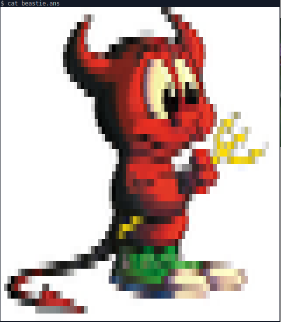
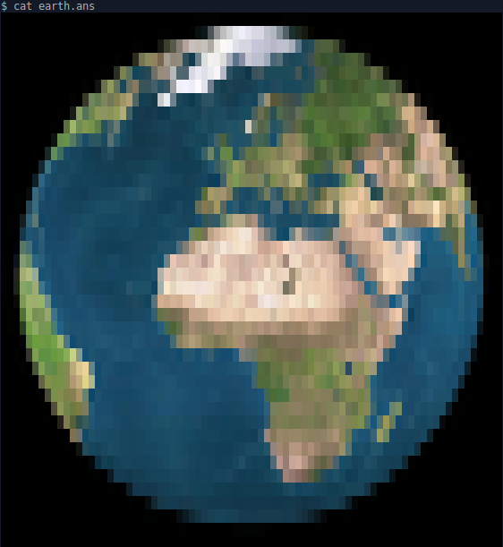
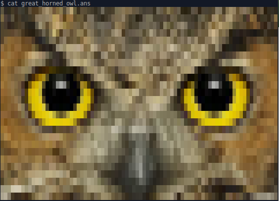
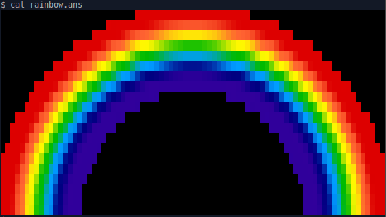
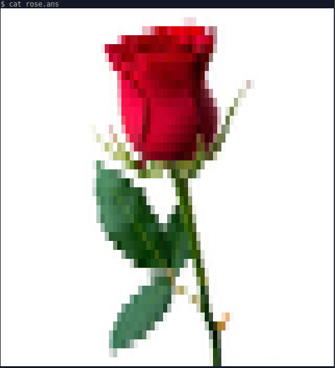
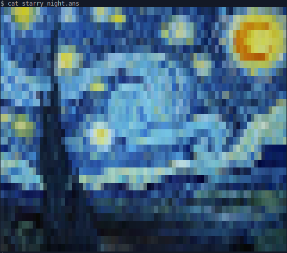
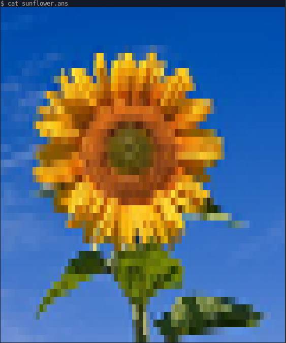
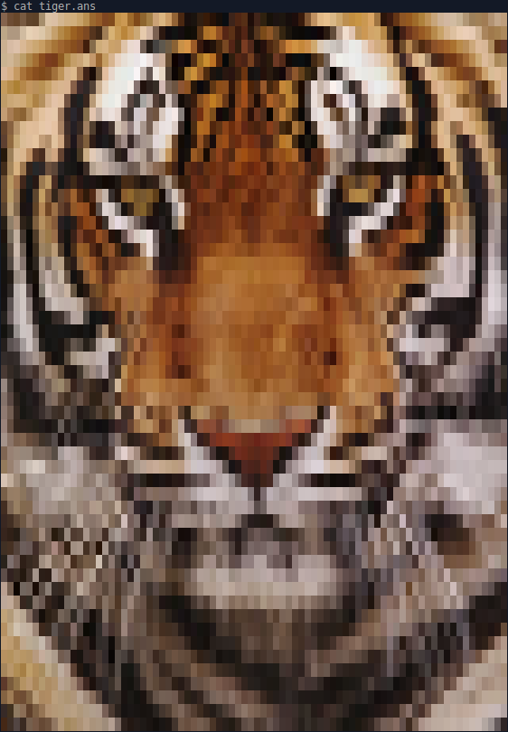
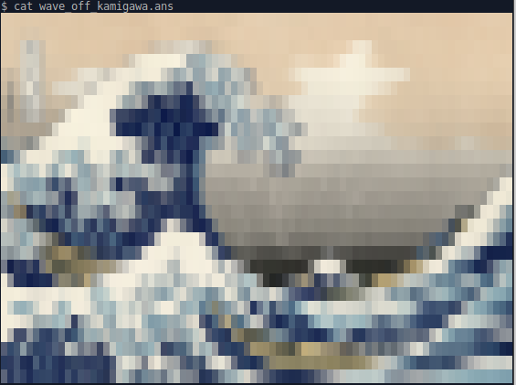

# Terminal True Color Art

_24-bit truecolor terminal art using ANSI escape codes_

This art is generated by a modified version of Egmont Koblinger's
[img.sh](https://gitlab.gnome.org/GNOME/vte/blob/master/perf/img.sh) as /img.sh.
You can use these images, especially `colorline.ans` and `ansitesting.ans` to
verify true color compatibility. Follow usage to see the SGR images in ans/ and verify
that they look like the pixel image in img/. 

For information on 24-bit true color and
terminal support for it, check out https://github.com/termstandard/colors.
For information on SGR codes, Wikipedia has a [good
section](https://en.wikipedia.org/wiki/ANSI_escape_code#SGR_(Select_Graphic_Rendition)_parameters)
on it.

## Usage

You can use these images to verify whether your terminal supports 24-bit
truecolor using ANSI escape codes. To view the images, use your OS's file print
utility:

| Platform | Command           |
|----------|-------------------|
| \*nix    | `cat <file.ans>`  |
| Windows  | `type <file.ans>` |

To see all ans files sequentially, use `$command ans/*.ans`.

## Tests

Color line, 80w: 

Foreground and background test, 64w:

## Various Images, 80w

Beastie

Earth

Great Horned Owl

Rainbow

Rose

Starry Night

Sunflower

Tiger

Tux

Wave off Kamigawa

