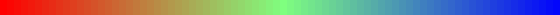
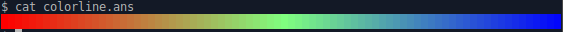
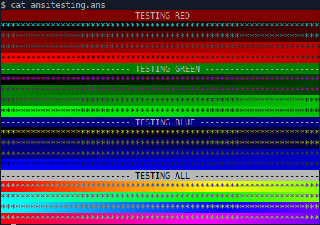
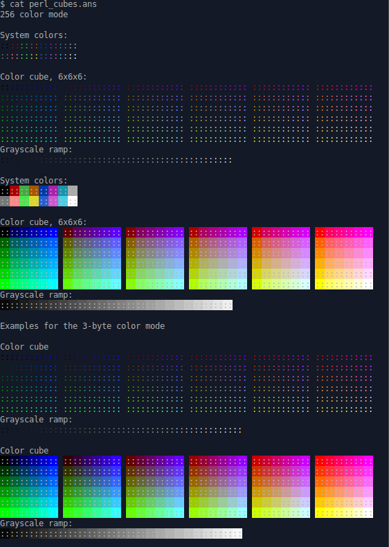
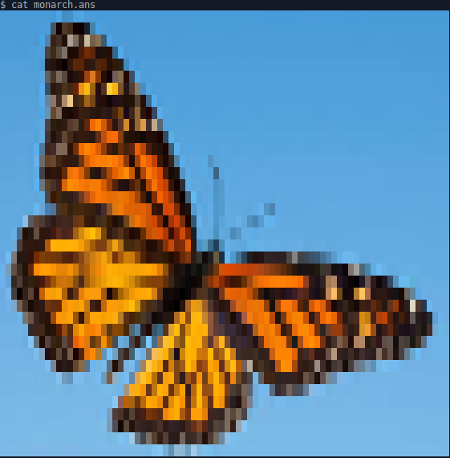

# Terminal True Color Art

_24-bit truecolor terminal art using ANSI escape codes_  

This art is generated by a modified version of Egmont Koblinger's
[img.sh](https://gitlab.gnome.org/GNOME/vte/blob/master/perf/img.sh) as img.sh.
You can use these images, especially `colorline.ans` and `ansitesting.ans` to
verify true color compatibility. Follow usage to see the SGR images in ans/ and verify
that they look like the pixel image in img/. 

For information on 24-bit true color and
terminal support for it, check out https://github.com/termstandard/colors.
For information on SGR codes, Wikipedia has a [good
section](https://en.wikipedia.org/wiki/ANSI_escape_code#SGR_(Select_Graphic_Rendition)_parameters)
on it.

## Usage

### Generating ans files

To generate ans files using img.sh, use 

    bash img.sh -common  | tee .ans

* `-common` will ensure that it has a semicolon delimeter which is the most
  supported type
* Using `tee` will show you the produced image as it is being saved

### Printing ans files

You can use these images to verify whether your terminal supports 24-bit
truecolor using ANSI escape codes. To view the images, use your OS's file print
utility:

| Platform | Command           |
|----------|-------------------|
| \*nix    | `cat <file.ans>`  |
| Windows  | `type <file.ans>` |

To see all ans files sequentially, use `$command ans/*.ans`.

## Tests

### Color line, 80w 

Modified from Anton Kochkov's [awk script](github.com/termstandard/colors)  

### Foreground and background test, 64w

Modified form of iTerm2 [24-bit
test](https://raw.githubusercontent.com/JohnMorales/dotfiles/master/colors/24-bit-color.sh):  

### Foreground and background test, 78w

Todd Larason's [perl
cubes](https://github.com/robertknight/konsole/blob/master/tests/color-spaces.pl)
Konsole test:  

## Various Images, 80w

### Wave off Kamigawa  

### Beastie  

### Butterfly

### Earth  

### Great Horned Owl  

### Rainbow  

### Rose  

### Starry Night  

### Sunflower  

### Tiger  

### Tux  

